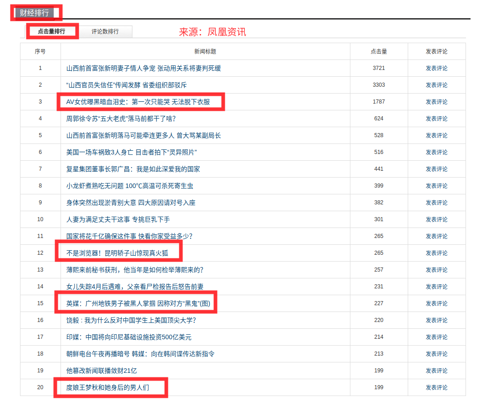

## 对新闻客户端的一点想法

#### 痛点：
- 客户端很多，新闻出处少
- 推送太多，垃圾广告信息太多
- 关心的领域推送不及时
- 要不是就是大量文字堆砌，要不就是没有营养的图片太多
- 阅读困难，相关引导阅读信息乱，容易跑偏浪费时间

#### BrainStorme
1. 主流新闻门户新闻爬取
2. 新闻自带分类tag+标题NLP语义分词分析
3. 关键词提取，分类算法，频度统计
4. 图表化新闻（受百度指数启发），点击相关关键词，进入相关新闻列表

#### Found
  

1. 新闻分类混乱
2. 靠用户点击的排行并不能保证质量
3. 还是猎奇新闻最能吸引眼球

#### What I want

- 热度越高，关键词体积越大，颜色越红
- 做到伪实时，类似于舆情监控
- 去掉人为分类因素，真的筛选出关心的关键词相关的新闻集合